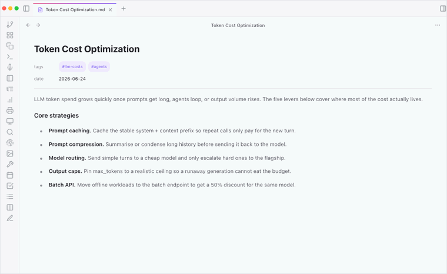

**English** | [中文 (Simplified)](#vault-operator-中文)

# Vault Operator

**Agentic AI operating layer for your vault.**

<p align="center">
  
</p>

You describe a task, it plans, searches, reads, writes, and reports back. Every action is visible. Every write needs your approval. Every change is undoable in one click.

Free. Open source. Local-first. Works with cloud models, with your existing ChatGPT or Copilot subscription, or fully offline with Ollama or LM Studio.

[Documentation](https://pssah4.github.io/vault-operator) | [Install from Obsidian](obsidian://show-plugin?id=vault-operator) | [Community page](https://community.obsidian.md/plugins/vault-operator)

---

## What people are saying

> "Vault Operator might be the best Obsidian agentic AI plugin out there."
> *Nick, Buy Me a Coffee*

> "I've just discovered your wonderful plugin, which to me is way more than a simple plugin. It is a real harness inside Obsidian. That's awesome!"
> *arkham000, GitHub*

> "Vault Operator is one of the most interesting and powerful Obsidian plugins I've tried so far. The combination of agent functionality, vault access and document processing is particularly impressive."
> *Stapledon-de, GitHub*

> "Love your work with Vault Operator."
> *mikaljrue, Buy Me a Coffee*

> "Vault Operator plugin is exactly what I was looking for. The ability to plug in MCP, the support for various models and providers, the skills, and workflows. I am really looking forward to get my hands dirty. I am hoping I won't need to use VS Code + GitHub Copilot to help me manage my vault anymore."
> *Buy Me a Coffee supporter*

> "I have only just started, but this is real motivation to get back into Obsidian again."
> *hkocam, Buy Me a Coffee (translated from German)*

---

## What you get

A chatbot reads your prompt and answers. Vault Operator runs a loop: it picks an action, executes it against your vault, feeds the result back to the model, and continues until the task is done.

- **Inline AI chat.** Select text in any note and press Cmd+Shift+I (Ctrl+Shift+I on Windows and Linux), or right-click and choose "Inline AI chat", to open a floating chat panel anchored over the selection. The panel runs the same agent loop as the sidebar (skills, MCP, memory) and ships quick actions for Lookup (vault search with optional web fallback), Rewrite, Translate, Summarize, and Find action items. Available since v3.0.0. [Chat interface guide](https://pssah4.github.io/vault-operator/guides/chat-interface).
- **Run several chats at once.** Open independent conversations in their own tabs, each with its own mode and attachments. A long-running task keeps working in one tab while you start another; interrupted runs resume from history. Available since v3.3.1.
- **Capture sources with block-level provenance.** Drop a PDF into the chat, get a source note where every key claim links back to the exact paragraph in the original.
- **Clip web pages into your vault.** Give the agent a URL and it archives the full page as a Markdown note, downloads the images as real vault files, and rewrites the links to point at the local copies. Available since v3.3.6.
- **Three-layer memory across sessions.** Short-term session summaries, durable facts that survive resets, and a soul profile of how you write and how you want the agent to behave.
- **Find notes by meaning, not by filename.** Local vector index, full-text keyword search, graph expansion through wikilinks, and a local cross-encoder reranker, combined with weighted RRF.
- **Build Word and Excel files, draft PowerPoint decks (PPTX in beta).** Turn project notes into a DOCX, structured data into an XLSX, or meeting notes into a draft PPTX.
- **Run a vault health check.** Surfaces orphans, broken links, missing backlinks, weak clusters, and over-connected hubs. Every fix creates a checkpoint you can undo.
- **Use the vault from ChatGPT, Claude Desktop, or Perplexity.** Vault Operator runs as an MCP server, so your other AI clients can read the same memory and history as the in-Obsidian agent.
- **Hold the keys with auto-approve.** Fail-closed by default. Per-category toggles for read, write, plugin-API, command, MCP, and web. One permission center lists every individual grant the agent holds so you can review and revoke any of them. Sensitive folders are gated by a `.obsidian-agentignore` file.
- **Reuse what Obsidian already exposes.** Plugin-API discovery lets the agent invoke installed plugins (Excalidraw, Dataview, Tasks) instead of duplicating their work.

---

## What it does for knowledge work

### Capture sources with provenance

Drop a PDF or a Markdown source into the chat and ask for an ingest. The agent produces a clean source note with block IDs on every key claim, so each fact links back to the exact paragraph in the original.

Two paths:

- **"Ingest this PDF as a source note."** Quick capture. Single-pass. One source, one note, about three minutes.
- **"Do a deep ingest of this paper."** Sense-making. The agent triages the source against what your vault already knows, deep-ingests it with block IDs, writes the sense-making notes, and sets the backlinks. Five to fifteen minutes for a real research paper.

[Sense-making tutorial](https://pssah4.github.io/vault-operator/tutorials/deep-ingest) | [Block-level provenance concept](https://pssah4.github.io/vault-operator/concepts/provenance)

### Search by meaning, not by filename

A local vector index over your vault, plus full-text keyword search, graph expansion through wikilinks, and a local cross-encoder reranker. Ask "what do I know about X?" and the agent finds notes whose meaning is related, even when none of them contain the words you used.

The background analysis also surfaces note pairs that discuss similar topics without any wikilink between them, so you can spot connections you never wrote down.

[Knowledge discovery guide](https://pssah4.github.io/vault-operator/guides/knowledge-discovery)

### Build Word and Excel, draft PowerPoint (PPTX beta)

Turn project notes into a Word document, structured data into Excel, or meeting notes into a draft PowerPoint deck. DOCX and XLSX output is clean and reliable. PPTX is in beta: corporate template cloning is not supported in this version, so treat client-facing decks as a starting point and finish them by hand.

[Office documents guide](https://pssah4.github.io/vault-operator/guides/office-documents)

### Keep the vault navigable

The vault health check audits your knowledge graph for orphans, broken links, missing backlinks, weak clusters, inconsistent tags, and over-connected hubs. Findings come with actions: apply a mechanical fix, open a discussion with the agent, or dismiss. Every repair creates a checkpoint you can undo.

[Vault health check guide](https://pssah4.github.io/vault-operator/guides/vault-health)

### Stay in control

Vault Operator is fail-closed. Write operations need your approval unless you opted into auto-approve for that category. Every task creates checkpoints in a shadow git repository (separate from your own git history). Click "Undo all changes" in the chat and the files go back. Sensitive folders are gated by a `.obsidian-agentignore` file at the vault root.

[Safety and control guide](https://pssah4.github.io/vault-operator/guides/safety-control) | [Checkpoints concept](https://pssah4.github.io/vault-operator/concepts/checkpoints)

---

## Try it

Vault Operator requires Obsidian 1.8.7 or newer.

1. **Install.** Obsidian Settings > Community Plugins > Browse > "Vault Operator" > Install + Enable.
2. **Add a provider.** Settings > Vault Operator > Providers > Providers > "+ Add provider". A free [Google AI Studio](https://aistudio.google.com/app/apikey) key is enough to try everything.
3. **Open the sidebar and ask a question.** "What are my most-linked notes?" works on any vault. The first-run wizard walks you through the rest.

For semantic search and the ingest workflows, also configure an embedding model in Settings > Vault Operator > Providers > Embeddings. The [Quick start tutorial](https://pssah4.github.io/vault-operator/tutorials/getting-started) covers every step.

---

## Documentation

Full documentation lives at [pssah4.github.io/vault-operator](https://pssah4.github.io/vault-operator).

For end users:

- [Tutorials](https://pssah4.github.io/vault-operator/tutorials/getting-started). Step-by-step walkthroughs from first install to deep-ingest sense-making.
- [Guides](https://pssah4.github.io/vault-operator/guides/capabilities). Reference for daily work.
- [Reference](https://pssah4.github.io/vault-operator/reference/tools). Tools, providers, settings, troubleshooting.

For developers:

- [Codebase tour](https://pssah4.github.io/vault-operator/concepts/codebase-tour). Directory layout, reading order, Kilo Code heritage.
- [Concepts](https://pssah4.github.io/vault-operator/concepts/). Agent loop, governance, knowledge layer, memory system, MCP architecture.

---

## Building from source

```bash
git clone https://github.com/pssah4/vault-operator.git
cd vault-operator
npm install
npm run build
```

Then copy `main.js`, `manifest.json`, and `styles.css` from the repo root into `<vault>/.obsidian/plugins/vault-operator/`. For watch mode and auto-deploy during development, point `PLUGIN_DIR` in `.env` at your test vault and run `npm run dev`.

Requirements: Obsidian 1.8.7 or newer, desktop only, Node.js 18+ for building.

---

## Network usage and local capabilities

Vault Operator is local-first. No telemetry, no analytics, no accounts.

The plugin makes network requests in four situations, all under your control:

- **LLM API calls** to the provider you configured (Anthropic, OpenAI, Google, AWS Bedrock, OpenRouter, Azure, GitHub Copilot OAuth, ChatGPT OAuth, Kilo Gateway, Ollama, LM Studio, or any OpenAI-compatible endpoint).
- **Web search** (optional, disabled by default) when you use the `web_search` tool, going to Brave or Tavily.
- **MCP servers** you connected explicitly, plus the optional remote-MCP relay if you want cross-surface workflows with ChatGPT or Claude Desktop.
- **The skill registry**, when you open it in Settings and press Load catalogue or Install. It reads `catalog.json` and the skill package from `raw.githubusercontent.com`. Nothing is fetched on startup, no account is involved, and the request carries no information about you or your vault. Downloads are verified against the checksum in the catalogue before anything is written.

Skills installed from the registry are not privileged. They install as `Registry`, and the agent still asks for approval before one of them changes anything, exactly as it does for a skill you wrote. Only the skills that ship inside the plugin are trusted.

The plugin also uses a few Node.js capabilities that go beyond the standard Obsidian API: filesystem access for the local knowledge database and the office document pipeline, shadow git for checkpoints, sandbox process spawning for `evaluate_expression`, and optional LibreOffice spawning for presentation rendering. Two paths write outside the vault: device-local state under `~/.obsidian-agent/` and the checkpoint shadow repository next to the vault folder. Everything else stays under the vault path or the plugin data directory. Commands are fixed binaries with structured arguments; the agent does not construct shell commands from chat text.

API keys are encrypted via Electron's `safeStorage` (OS keychain on macOS, Credential Manager on Windows, libsecret on Linux). Where `safeStorage` is not available, keys fall back to plain plugin settings.

---

## License

Apache 2.0.

## Acknowledgements

- [Kilo Code](https://kilocode.ai) for architectural inspiration.
- [Obsidian](https://obsidian.md) as the platform.
- [sql.js](https://github.com/sql-js/sql.js) for SQLite in WebAssembly powering the knowledge layer.
- [Hugging Face Transformers.js](https://github.com/huggingface/transformers.js) for local ONNX reranking.
- [isomorphic-git](https://isomorphic-git.org) for pure-JS git checkpoints.
- [MCP SDK](https://github.com/modelcontextprotocol/typescript-sdk) for the Model Context Protocol.

---

# Vault Operator (中文)

[English above / 返回英文版](#vault-operator)

**面向你的知识库(vault)的智能体 AI 操作层。**

<p align="center">
  
</p>

你描述一个任务,它就会规划、搜索、阅读、写入并向你汇报。每一个操作都可见。每一次写入都需要你的批准。每一处改动都能一键撤销。

免费。开源。本地优先。可以配合云端模型使用,可以用你现有的 ChatGPT 或 Copilot 订阅,也可以借助 Ollama 或 LM Studio 完全离线运行。

[文档](https://pssah4.github.io/vault-operator) | [从 Obsidian 安装](obsidian://show-plugin?id=vault-operator) | [社区页面](https://community.obsidian.md/plugins/vault-operator)

---

## 用户评价

> "Vault Operator 可能是目前最好的 Obsidian 智能体 AI 插件。"
> *Nick, Buy Me a Coffee*

> "我刚发现你这个出色的插件,对我来说它远不只是一个简单的插件。它是 Obsidian 内部一个真正的运行框架(harness)。太棒了!"
> *arkham000, GitHub*

> "Vault Operator 是我至今试过的最有意思、最强大的 Obsidian 插件之一。智能体功能、知识库访问和文档处理的结合尤其令人印象深刻。"
> *Stapledon-de, GitHub*

> "很喜欢你在 Vault Operator 上做的工作。"
> *mikaljrue, Buy Me a Coffee*

> "Vault Operator 插件正是我一直在找的东西。能接入 MCP、支持各种模型和提供商、还有 skills 和工作流。我真的很期待上手试试。希望以后不用再靠 VS Code + GitHub Copilot 来帮我管理知识库了。"
> *Buy Me a Coffee supporter*

> "我才刚刚开始用,但这确实让我有动力重新回到 Obsidian。"
> *hkocam, Buy Me a Coffee (译自德语)*

---

## 你能得到什么

聊天机器人读取你的提示词然后作答。Vault Operator 则运行一个循环:它挑选一个操作,在你的知识库上执行,把结果反馈给模型,如此持续,直到任务完成。

- **行内 AI 聊天。** 在任意笔记中选中文本并按 Cmd+Shift+I(Windows 和 Linux 上是 Ctrl+Shift+I),或右键选择 "Inline AI chat",即可打开一个锚定在选区上方的悬浮聊天面板。该面板运行与侧边栏相同的智能体循环(skills、MCP、记忆),并附带若干快捷操作:Lookup(知识库搜索,可选网络回退)、Rewrite、Translate、Summarize 和 Find action items。自 v3.0.0 起可用。[Chat interface guide](https://pssah4.github.io/vault-operator/guides/chat-interface)。
- **同时运行多个聊天。** 在各自的标签页中打开彼此独立的对话,每个对话都有自己的模式和附件。一个长时间运行的任务会在某个标签页里持续工作,同时你可以开启另一个;被中断的运行会从历史记录中恢复。自 v3.3.1 起可用。
- **以块级溯源捕获来源。** 把一个 PDF 拖进聊天,你会得到一份来源笔记,其中每一条关键论断都链接回原文中确切的段落。
- **把网页剪藏进你的知识库。** 给智能体一个 URL,它就会把整个页面存档为一份 Markdown 笔记,把其中的图片作为真实的知识库文件下载下来,并把链接改写为指向本地副本。自 v3.3.6 起可用。
- **跨会话的三层记忆。** 短期会话摘要、在重置后依然保留的持久事实,以及一份 soul 档案,记录你如何写作、以及你希望智能体如何行事。
- **按含义查找笔记,而不是按文件名。** 本地向量索引、全文关键词搜索、通过 wikilinks 进行的图谱扩展,以及本地 cross-encoder 重排器(reranker),再用加权 RRF 组合在一起。
- **生成 Word 和 Excel 文件,起草 PowerPoint 演示(PPTX 处于 beta 阶段)。** 把项目笔记变成 DOCX,把结构化数据变成 XLSX,或把会议记录变成 PPTX 草稿。
- **运行知识库健康检查。** 找出孤立笔记、失效链接、缺失的反向链接、薄弱的聚类,以及连接过多的枢纽节点。每一次修复都会创建一个可以撤销的检查点。
- **从 ChatGPT、Claude Desktop 或 Perplexity 使用你的知识库。** Vault Operator 可以作为 MCP 服务器运行,因此你的其他 AI 客户端可以读取与 Obsidian 内智能体相同的记忆和历史。
- **通过自动批准掌控大权。** 默认 fail-closed(默认拒绝)。可按类别分别开关:read、write、plugin-API、command、MCP 和 web。一个统一的权限中心会列出智能体持有的每一项单独授权,方便你审查并撤销其中任意一项。敏感文件夹由一个 `.obsidian-agentignore` 文件把关。
- **复用 Obsidian 已经暴露的能力。** Plugin-API 发现机制让智能体可以调用已安装的插件(Excalidraw、Dataview、Tasks),而不必重复实现它们的功能。

---

## 它为知识工作做了什么

### 带溯源地捕获来源

把一个 PDF 或 Markdown 来源拖进聊天,然后请求做一次 ingest。智能体会生成一份干净的来源笔记,在每一条关键论断上都带有 block ID,因此每个事实都能链接回原文中确切的段落。

两条路径:

- **"Ingest this PDF as a source note."** 用于快速捕获。单次处理。一个来源、一份笔记,大约三分钟。
- **"Do a deep ingest of this paper."** 用于意义构建。智能体会先对来源做分诊,对照你知识库里已有的内容做出决策,然后带着 block ID 做深度 ingest,写出意义构建笔记,并设置反向链接。对一篇真正的研究论文来说需要五到十五分钟。

[Sense-making tutorial](https://pssah4.github.io/vault-operator/tutorials/deep-ingest) | [Block-level provenance concept](https://pssah4.github.io/vault-operator/concepts/provenance)

### 按含义搜索,而不是按文件名

在你的知识库上建立本地向量索引,再加上全文关键词搜索、通过 wikilinks 进行的图谱扩展,以及本地 cross-encoder 重排器。问一句 "what do I know about X?",智能体就会找出含义相关的笔记,哪怕它们一个都不包含你用过的词。

后台分析还会找出那些讨论相似主题、但彼此之间没有任何 wikilink 的笔记对,让你发现自己从未写下来的联系。

[Knowledge discovery guide](https://pssah4.github.io/vault-operator/guides/knowledge-discovery)

### 生成 Word 和 Excel,起草 PowerPoint(PPTX beta)

把项目笔记变成 Word 文档,把结构化数据变成 Excel,或把会议记录变成 PowerPoint 演示草稿。DOCX 和 XLSX 的输出干净可靠。PPTX 处于 beta 阶段:此版本不支持克隆企业模板,因此请把面向客户的演示当作一个起点,再手动完成收尾。

[Office documents guide](https://pssah4.github.io/vault-operator/guides/office-documents)

### 让知识库保持可导航

知识库健康检查会审查你的知识图谱,查找孤立笔记、失效链接、缺失的反向链接、薄弱的聚类、不一致的标签,以及连接过多的枢纽节点。每条发现都附带操作:应用一个机械化修复、与智能体展开讨论,或忽略。每一次修复都会创建一个可以撤销的检查点。

[Vault health check guide](https://pssah4.github.io/vault-operator/guides/vault-health)

### 保持掌控

Vault Operator 是 fail-closed 的。写操作需要你的批准,除非你已为该类别选择了自动批准。每个任务都会在一个影子 git 仓库(与你自己的 git 历史相互独立)中创建检查点。在聊天里点击 "Undo all changes",文件就会还原。敏感文件夹由知识库根目录下的一个 `.obsidian-agentignore` 文件把关。

[Safety and control guide](https://pssah4.github.io/vault-operator/guides/safety-control) | [Checkpoints concept](https://pssah4.github.io/vault-operator/concepts/checkpoints)

---

## 试一试

Vault Operator 需要 Obsidian 1.8.7 或更新版本。

1. **安装。** Obsidian Settings > Community Plugins > Browse > "Vault Operator" > Install + Enable。
2. **添加一个提供商。** Settings > Vault Operator > Providers > Providers > "+ Add provider"。一个免费的 [Google AI Studio](https://aistudio.google.com/app/apikey) 密钥就足以试用所有功能。
3. **打开侧边栏并提一个问题。** "What are my most-linked notes?" 在任何知识库上都能用。首次运行向导会带你完成其余步骤。

若要使用语义搜索和 ingest 工作流,还需要在 Settings > Vault Operator > Providers > Embeddings 中配置一个 embedding 模型。[Quick start tutorial](https://pssah4.github.io/vault-operator/tutorials/getting-started) 涵盖了每一个步骤。

---

## 文档

完整文档位于 [pssah4.github.io/vault-operator](https://pssah4.github.io/vault-operator)。

面向终端用户:

- [Tutorials](https://pssah4.github.io/vault-operator/tutorials/getting-started)。从首次安装到用深度 ingest 做意义构建的分步演练。
- [Guides](https://pssah4.github.io/vault-operator/guides/capabilities)。日常工作的参考。
- [Reference](https://pssah4.github.io/vault-operator/reference/tools)。工具、提供商、设置、故障排查。

面向开发者:

- [Codebase tour](https://pssah4.github.io/vault-operator/concepts/codebase-tour)。目录结构、阅读顺序、Kilo Code 的传承。
- [Concepts](https://pssah4.github.io/vault-operator/concepts/)。智能体循环、治理、知识层、记忆系统、MCP 架构。

---

## 从源码构建

```bash
git clone https://github.com/pssah4/vault-operator.git
cd vault-operator
npm install
npm run build
```

然后把仓库根目录下的 `main.js`、`manifest.json` 和 `styles.css` 复制到 `<vault>/.obsidian/plugins/vault-operator/`。若要在开发过程中使用 watch 模式和自动部署,请把 `.env` 里的 `PLUGIN_DIR` 指向你的测试知识库,然后运行 `npm run dev`。

要求:Obsidian 1.8.7 或更新版本,仅限桌面端,构建需要 Node.js 18+。

---

## 网络使用与本地能力

Vault Operator 是本地优先的。没有遥测,没有分析统计,没有账户。

插件会在三种情形下发起网络请求,全都在你的掌控之下:

- **LLM API 调用**,发往你配置的提供商(Anthropic、OpenAI、Google、AWS Bedrock、OpenRouter、Azure、GitHub Copilot OAuth、ChatGPT OAuth、Kilo Gateway、Ollama、LM Studio,或任何 OpenAI 兼容的端点)。
- **网络搜索**(可选,默认关闭),当你使用 `web_search` 工具时,会发往 Brave 或 Tavily。
- **MCP 服务器**,即你显式连接的那些,外加可选的远程 MCP 中继(remote-MCP relay),供你想要在 ChatGPT 或 Claude Desktop 之间进行跨界面工作流时使用。

插件还使用了少数几项超出标准 Obsidian API 的 Node.js 能力:为本地知识数据库和 office 文档流水线提供的文件系统访问、用于检查点的影子 git、为 `evaluate_expression` 启动的沙箱进程,以及用于渲染演示文稿的可选 LibreOffice 进程。所有写入都保持在知识库路径或插件数据目录之内。命令都是带有结构化参数的固定二进制程序;智能体不会用聊天文本拼出 shell 命令。

API 密钥通过 Electron 的 `safeStorage` 加密(macOS 上是系统钥匙串,Windows 上是凭据管理器,Linux 上是 libsecret)。在 `safeStorage` 不可用的地方,密钥会回退到明文的插件设置中。

---

## 许可证

Apache 2.0。

## 致谢

- [Kilo Code](https://kilocode.ai),感谢其在架构上的启发。
- [Obsidian](https://obsidian.md),作为平台。
- [sql.js](https://github.com/sql-js/sql.js),以 WebAssembly 中的 SQLite 驱动知识层。
- [Hugging Face Transformers.js](https://github.com/huggingface/transformers.js),用于本地 ONNX 重排。
- [isomorphic-git](https://isomorphic-git.org),用于纯 JS 的 git 检查点。
- [MCP SDK](https://github.com/modelcontextprotocol/typescript-sdk),用于 Model Context Protocol。
