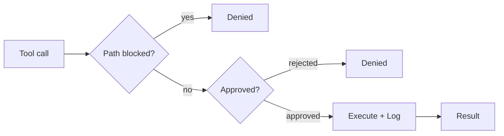

# Governance

This is what makes it safe to give an AI write access to your notes.

The principle is fail-closed. If anything goes wrong during an approval check (a missing callback, an unloaded config, an unexpected error), the operation is denied. The agent never silently auto-approves. Every tool call, internal or MCP, flows through one central pipeline.

## The pipeline

`ToolExecutionPipeline` (`src/core/tool-execution/ToolExecutionPipeline.ts`) is the single enforcement point. Nothing bypasses it.

Three questions, in order. Is the path allowed? Is the operation approved? Only then does the tool run, and the result is logged afterward.

## Path protection

Two files in the vault root control which paths the agent can access:

| File | Effect |
|------|--------|
| `.obsidian-agentignore` | Paths completely invisible to the agent. Uses gitignore syntax. |
| `.obsidian-agentprotected` | Paths readable but never writable, even with explicit approval. |

Both files use glob patterns. A line like `journal/private/**` blocks everything under that folder.

Some paths are always blocked regardless of configuration: `.git/`, Obsidian workspace files, and cache files. The governance config files themselves are always write-protected, so the agent cannot edit its own restrictions.

The `IgnoreService` (`src/core/governance/IgnoreService.ts`) enforces this. If it hasn't finished loading its patterns yet, it denies all access. Fail-closed.

## Approval effects (ADR-153)

Every tool call routes through the same approval check. What a tool is *allowed* to do is not something the tool declares about itself; it comes from one central registry, `TOOL_EFFECTS` in `src/core/tools/toolEffects.ts`, which maps every tool to exactly one effect class. The pipeline resolves the effect, looks up its policy in `EFFECT_POLICY`, and decides. A tool with no entry fails closed: it is treated as unclassified and always asks. This is deliberate. The earlier design let a tool opt out of approval by self-declaring `isWriteOperation = false`, and a handful of side-effecting tools did exactly that. The effect now comes from outside the tool.

The master toggle lives under Settings > Vault Operator > Agents > Permissions and ships **off**. With it off, every effect that writes, spends money, or leaves the device asks for confirmation.

| Effect | Examples | Policy |
|--------|----------|--------|
| `read` | `read_file`, `search_files`, `semantic_search`, `read_document` | Always auto. Reads never change the vault, so they run without asking and independently of the master toggle. There is no read toggle. |
| `ui` | `attempt_completion`, `update_todo_list`, `find_tool`, loop control | Always auto. Internal loop and UI control, master-independent. |
| `note-edit` | `write_file`, `edit_file`, `append_to_file`, `update_frontmatter`, `ingest_document`, `ingest_deep`, `ingest_triage` | Asks, unless the master AND the note-edits toggle are on. |
| `vault-change` | `create_folder`, `delete_file`, `move_file`, `extract_zip`, `restore_checkpoint`, Office/canvas creators | Asks, unless the master AND the vault-changes toggle are on. |
| `web` | `web_fetch`, `web_search`, `anti_echo_search` | Asks, unless the master AND the web toggle are on. |
| `mcp` | `use_mcp_tool`, `invoke_mcp_server` | Asks, unless the master AND the MCP toggle are on. |
| `subtask` | `new_task` | Asks, unless the master AND the subtasks toggle are on. |
| `skill` | `invoke_skill` | Asks, unless the master AND the skills toggle are on. Only skills from a trusted source (built-in / Pro) can auto-approve; an imported or self-authored skill still prompts. |
| `recipe` | `execute_recipe` | Asks, unless the master AND the recipes toggle are on. |
| `plugin-api` | `call_plugin_api` | Two flags: reads and writes hang off different toggles. The read/write decision comes from the call input, resolved the same way in the gate and in the "Always allow" button so they cannot disagree. |
| `sandbox` | `evaluate_expression`, `run_skill_script`, dynamic `custom_*` skill tools | Asks, unless the master AND the sandbox toggle are on. The toggle carries an explicit high-risk confirmation, because the code is authored by the LLM or a third-party skill. |
| `config` | `update_settings`, `configure_model`, `manage_mcp_server` | **Always asks. Can never be auto-approved.** This is the lock against self-escalation: the agent cannot turn its own permissions on. |
| `self-modify` | `update_soul`, `mark_for_memory`, `manage_source` | **Always asks. Can never be auto-approved.** Persona, memory, and source changes are always a human decision. |

`config` and `self-modify` are the two effects the master toggle and every preset can never reach. An agent that could talk its way into "don't ask again" for its own settings would have re-opened the exact hole this design closes.

**Escalation levels.** For any effect except `config` and `self-modify`, the approval card offers a four-step scope ladder:

1. **Allow once**: this single call.
2. **Allow for this run**: the grant dies with the current task and is never persisted. Run-scoped grants are inherited by sub-tasks and invoked skills.
3. **Allow this session**: the grant outlives individual tasks but lives only in memory. It is never written to disk and disappears when the plugin reloads.
4. **Always allow**: a standing auto-approval that enables the matching settings category.

Run- and session-scoped grants cover the whole effect class of the approved card: a session grant given on a `delete_file` card also covers the other vault-change tools until the plugin reloads. Only `call_plugin_api` grants carry one refinement on top of the class: the grant records whether the approved call was a read or a write, so approving a read for the run or session never covers writes. High-blast-radius operations always re-ask even when their effect class was approved for the run or the session: `restore_checkpoint` (mass rollback), `extract_zip` (bulk extraction), and the `vault_health_check` repair actions (`fix_backlinks`, `cleanup`, `fix_categories`; mass frontmatter mutation across many notes). For `vault_health_check` the exemption is input-conditional, like the plugin-api read/write refinement: the read-only `check` stays covered by a vault-change grant, while each mass repair raises its own scope card.

**The diff gate.** CUD tools that can compute what they would do without doing it (`write_file`, `edit_file`, `append_to_file`, `update_frontmatter`, `delete_file`, `set_block_anchors`, `mark_note_as_memory_source`, `unmark_note_as_memory_source`) show a real pre-write diff. The diff is produced by the same resolver that performs the write, so the preview cannot lie, and rejecting means the tool never runs. `delete_file` renders the whole doomed note as a deletion diff.

**Batch and scope approval.** Multi-file tools get ONE approval for the whole operation instead of a blind name card or a card per file. A tool that can enumerate its planned writes without performing them presents that plan to the gate, in one of two honest forms:

- **Multi-entry diff review.** When per-file before/after content is computable, the gate opens the same review used after tasks: one real diff per file, with a per-file Skip. Approving applies the un-skipped subset; skipping every file or discarding rejects the call. The review is read-only in this role: the tool performs its writes internally, so a hand edit inside one entry could not be honored, and the pipeline drops any stray edited content from batch approvals. `restore_checkpoint` works this way: current content versus snapshot content for every restored file, a deletion entry for every file the task created, and the skip decisions travel into the restore itself (a skipped file is neither rewritten nor trashed).
- **Scope card.** When the per-file result depends on processing the tool has not done yet, the card presents the planned file list plus an operation summary (20 visible rows, the full list under details), and the decision is all-or-nothing. That is still one honest approval for a defined scope. `vault_health_check` repairs (`fix_backlinks`, `cleanup`, `fix_categories`) plan their exact target set through the same selection code the repair runs, pinned by parity tests; `extract_zip` plans through a dry run of the same extraction code; `ingest_document` and `ingest_deep` (source-only mode) name the files they will create or annotate.

The plan must cover every file the tool would touch. Where that cannot be guaranteed up front (ingest output modes that name their files while running, the PDF markdown-mirror path), the tool falls back to the plain card rather than presenting an underlisted scope. Diff-review batch approvals count as diff-reviewed, so those files do not resurface in the post-task review; scope-card approvals do not (no diff was shown), and the post-task review remains their diff surface. A diff review is only a review at readable size: above 100 entries the pipeline itself downgrades the batch to a scope card before the gate opens, and the approval accordingly does not count as diff-reviewed. The cap lives in the pipeline contract, not in the UI, so what the gate showed and what the pipeline records can never disagree.

The approved plan also binds the execution. After an approved batch gate the pipeline hands the tool the approved path set: the un-skipped subset from a diff review, or the full planned list from a scope card. Tools that re-select their targets at execute time (the `vault_health_check` repairs) honor that set as a filter, so a file that drifted into the selection while the card was open (a user edit, a metadata-cache refresh, a concurrent task) is skipped, not silently written. The repair writes only what the card showed.

**Known limitation: card-only approvals.** Some write tools cannot produce a meaningful text diff, and for them the gate deliberately shows the plain approval card (tool name, target, parameters) instead of pretending. This covers the binary and structured creators (`create_pptx`, `create_docx`, `create_xlsx`, `create_excalidraw`, `create_drawio`, `create_base`, `update_base`, `generate_canvas`), path-level operations (`move_file`, `create_folder`), and tools whose persistent effect is a database record rather than file content (`ingest_triage` writes a triage-log entry, not the note). Every one of these still asks; what it cannot show is a line-by-line preview of a format that has no lines.

**Sandbox governance.** Sandbox code reaches the vault through the `SandboxBridge`, which now obeys the same rules as the tools: it consults the `IgnoreService`, takes a checkpoint before each write, and treats the agent's own config folder (`.vault-operator/`, except the skill workspace) as a deny-zone, so a script cannot grant itself permissions by rewriting `settings.json`. A skill's trust class (`builtin` / `pro`) is verified against a provenance manifest the plugin controls, not read from the skill's own frontmatter, so a third-party skill cannot forge `source: pro`.

## Checkpoints

Before any write operation, the pipeline takes a git snapshot of the affected file. This uses a shadow repository at `{vault-parent}/vault-operator-shared/checkpoints/` (outside the vault, so Obsidian Sync and iCloud do not replicate it) powered by `isomorphic-git` (pure JavaScript, no native git binary needed).

`GitCheckpointService` (`src/core/checkpoints/GitCheckpointService.ts`) commits the file's current content into the shadow repo before the tool modifies it. Each checkpoint records the task ID, commit hash, timestamp, changed files, and the tool that triggered it. Files that didn't exist before the checkpoint are tracked separately so restore can delete them.

After any task, you can undo all changes. Every write operation gets its own checkpoint, so you can roll back to any intermediate state. The vault's own git history, if it has one, is never touched.

## The external MCP surface

When the local connector is enabled, external MCP clients (Claude Desktop, ChatGPT, Perplexity, or anything holding the bearer token) reach the vault through a second surface. It follows the same effect-based rules, adapted to a context that cannot show an approval card.

**Declared effects, derived gate.** Every MCP tool definition carries a mandatory effect declaration (`read`, `session`, `dispatch`, or `write`) in `src/mcp/toolDefinitions.ts`. The write gate is derived from those declarations, never hand-maintained next to them, and an undeclared or unknown tool resolves to `write`: forgetting a declaration gates a tool instead of exposing it. A drift test pins the ungated sets, mirroring the agent-side `TOOL_EFFECTS` contract.

**Standing consent instead of a card.** Write-class MCP tools (`write_vault`, `save_to_memory`, `update_memory`) are disabled by default and only run once you enable **Allow write tools over MCP** under Settings > Vault Operator > Customize > Connectors. The generic `execute_vault_op` dispatcher routes every operation through the same `ToolExecutionPipeline` as the agent, with an explicit headless approval policy: your toggle counts as standing consent for write effects (`note-edit`, `vault-change`), so `get_daily_note` with `create: true` follows the same decision as `write_vault`. With the toggle off, the client receives a clean error naming the setting, not a fabricated "denied by user".

**What no toggle can open.** `config` and `self-modify` effects (settings, persona, long-term-memory extraction via `mark_for_memory`) are rejected over MCP unconditionally. The self-escalation lock is checked before the consent set, so no standing consent can cover them. Effects that would genuinely need a human decision in the moment (web egress, sandbox execution, subtasks) are also unavailable headless. The headless policy is the sole authority on this surface: the in-app auto-approval toggles and any "for the rest of this run" grants apply only to the agent you supervise in the sidebar and never authorize an external MCP client.

**Compensating checkpoint.** Since no card is shown, `write_vault` snapshots every target file before the batch, and pipeline-routed writes get the usual per-write checkpoint, so an unwanted external write stays undoable via `restore_checkpoint`. Memory writes (`save_to_memory`, `update_memory`) persist single additive facts into the user-global memory database outside the vault, where the vault checkpoint cannot reach; the undo path there is deleting the fact in the Memory tab.

::: warning Breaking change in 3.2.4
`save_to_memory` and `update_memory` are now behind the same **Allow write tools over MCP** toggle as `write_vault` (default off). External clients that saved memory before 3.2.4 will receive an error naming the setting until you re-enable write access under Settings > Vault Operator > Customize > Connectors.
:::

## Audit log

Every tool call is logged to a JSONL file via `OperationLogger` (`src/core/governance/OperationLogger.ts`). One file per day, stored under the agent folder at `.vault-operator/data/logs/YYYY-MM-DD.jsonl`. Files older than 30 days get deleted automatically.

Each entry records:

| Field | Content |
|-------|---------|
| `timestamp` | ISO 8601 |
| `taskId` | Which task triggered the call |
| `mode` | Active mode at the time |
| `tool` | Tool name |
| `params` | Input parameters (PII-scrubbed) |
| `result` | Output summary (capped at 2000 chars) |
| `success` | Whether the call succeeded |
| `durationMs` | Execution time |

Sensitive values (passwords, tokens, API keys) are replaced with `[REDACTED]` before logging. File content fields are logged as `[N chars]` instead of the full text. URLs have credentials stripped.

The log is append-only during a session. You can read it with any tool that understands JSONL, or use the built-in `read_agent_logs` tool to have the agent analyze its own history.
